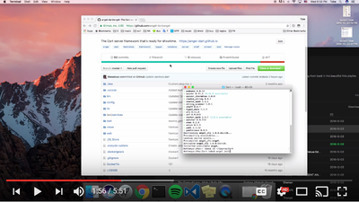

# Awesome Angel 
> A curated list of awesome [Angel](https://angel-dart.github.io) plug-ins, apps, and resources.

[Angel](https://angel-dart.github.io) is a full-featured, full-stack, server-side framework for the Dart programming language.
It is batteries-included and provides almost all of what you need for real world API's, out of the box. As an added bonus, Angel lets you share logic between the client and server, and has a thorough
[documentation](https://github.com/angel-dart/angel/wiki),
supplemented by a detailed
[Dartdoc](https://www.dartdocs.org/documentation/angel_common/latest) and multiple
[tutorials](#tutorials).

Feel free to star :star: this repo! And while you're at, star the
[main boilerplate](https://github.com/angel-dart/angel)! Many thanks!!!

Check out how to set up a basic Angel project!

## Contributing

Briefly read the [contribution guidelines](/CONTRIBUTING.md) before submitting a PR. A huge thanks to all [contributors](https://github.com/angel-dart/awesome-angel/graphs/contributors)!!!

## Contents
* [Example Projects](#example-projects)
* [Database Adapters](#database-adapters)
* [Plug-ins](#plug-ins)
* [Tutorials](#tutorials)
* [Companies using Angel in Production](#companies-using-angel-in-production)
* [Contributing](#contributing)

### Example Projects
* [Angel News - a Hacker News clone](https://github.com/angel-example/angel_news)

### Database Adapters
* [Firebase Firestore](https://github.com/netantho/angel_firestore)
* [PostgreSQL ORM](https://github.com/angel-dart/orm)
* [MongoDB](https://github.com/angel-dart/mongo)
* [RethinkDB](https://github.com/angel-dart/rethink)

### Plug-ins
* [JWT Authentication](https://github.com/angel-dart/auth)
* [Static Server](https://github.com/angel-dart/static)
* [WebSocket Support](https://github.com/angel-dart/websocket)

### Tutorials
* [Dependency Injection Patterns in Angel 2](https://thosakwe.com/dependency-injection-patterns-in-angel-2/)

#### Video Tutorials
* [Official Angel 2.0 Tutorial Playlist](https://www.youtube.com/playlist?list=PLl3P3tmiT-fqGCB2vSPq8HhpugEDNWUo6)
* [Angel GraphQL Demo](https://www.youtube.com/watch?v=5x6S4kDODa8&list=PLl3P3tmiT-fqGCB2vSPq8HhpugEDNWUo6&index=5&t=0s)
* [Pawan Kumar's Angel Series](https://www.youtube.com/watch?v=UzuecP3utk8&list=PLR2qQy0Zxs_VAUePvwLj7t7h6Ocb85A3H)
* [Jermaine Oppong's Angel Series](https://www.youtube.com/watch?v=iPbM10mvpko)
* [SwiftDE's Angel Series (Deutsch 🇩🇪)](https://www.youtube.com/playlist?list=PL9tE9XLX68n5eRLD7V3sBamJCnStMte5Y)

### Companies Using Angel in Production
This is a non-exhaustive list of production applications *known* to be using Angel.
At this time, only applications using Angel 2 are listed.

*The following two sites, previously listed here, are now offline:*
* https://getcuvr.com
* https://autistic.zone

Are you using Angel in the wild? Send a PR, and let us know! :fire:
